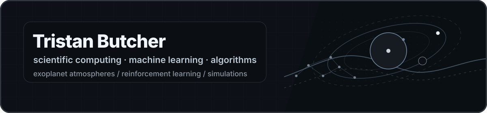

  

  <b>Scientific computing · Machine learning · Algorithms · Simulation</b>

  Grade 11 student from Waterloo, Ontario building projects around exoplanet atmospheres, reinforcement learning, search problems, and computational modeling.

---

## Featured work

<table>
<tr>
<td colspan="2" valign="top">

<h3>
  <a href="https://github.com/LordFurno/HyPCAR3">HyPCAR3</a>
</h3>

  A scientific computing pipeline for detecting and quantifying biosignature molecules in exoplanetary atmospheres.

  HyPCAR3 works with spectral data to identify molecular signatures associated with planetary atmospheres. The project combines data preprocessing, molecular absorption features, statistical reasoning, and machine-learning-based classification.

</td>
</tr>

<tr>
<td width="50%" valign="top">

<h3>
  <a href="https://github.com/LordFurno/deepQNetwork">deepQNetwork</a>
</h3>

  A Deep Q-Network implemented from scratch in Processing.

  Built to understand reinforcement learning below the library level, including state representation, action selection, neural network logic, reward design, and training behavior.

</td>
<td width="50%" valign="top">

<h3>
  <a href="https://github.com/LordFurno/Ant-Colony-Simulation">Ant Colony Simulation</a>
</h3>

  A Processing simulation of ant movement, pheromone trails, and emergent colony behavior.

  Agents follow local rules, deposit pheromones, and produce larger colony-level patterns over time.

</td>
</tr>

<tr>
<td width="50%" valign="top">

<h3>
  <a href="https://github.com/LordFurno/mlDotChallenge">mlDotChallenge</a>
</h3>

  A machine-learning challenge created for my school CS club.

  Designed to give students a practical model-improvement problem involving experimentation, iteration, and evaluation.

</td>
<td width="50%" valign="top">

<h3>
  <a href="https://github.com/LordFurno/scrabbleBot">scrabbleBot</a>
</h3>

  A Scrabble bot programming challenge focused on move generation and board evaluation.

  The project centers on search, scoring, word lookup, and algorithmic decision-making.

</td>
</tr>
</table>

---

## Earlier and experimental projects

- **[ExoSeer](https://github.com/LordFurno/ExoSeer)**: earlier exoplanet-atmosphere analysis project that led toward HyPCAR3.
- **[NoteFlow](https://github.com/LordFurno/NoteFlow)**:  team-built Processing project for music composition.
- **[tkinterGame](https://github.com/LordFurno/tkinterGame)**: procedurally generated 2D scrolling game built entirely in tkinter.
- **[Chaotic Encryption Experiment](https://github.com/LordFurno/A-Novel-Asymmetric-Chaotic-Encryption-Algorithm)**: early experimental cryptography project exploring chaotic maps and asymmetric-style encryption ideas
- **[finna-crashout](https://github.com/LordFurno/finna-crashout)**: hackathon prototype.

---
## Tools

<table>
<tr>
<td width="50%" valign="top">

<h3>Languages</h3>

  <code>Python</code>
  <code>C++</code>
  <code>Java</code>
  <code>Processing</code>

</td>
<td width="50%" valign="top">

<h3>ML / data</h3>

  <code>NumPy</code>
  <code>pandas</code>
  <code>scikit-learn</code>
  <code>TensorFlow / Keras</code>
  <code>PyTorch</code>

</td>
</tr>

<tr>
<td width="50%" valign="top">

<h3>Scientific computing</h3>

  <code>Matplotlib</code>
  <code>Plotly</code>
  <code>SciPy</code>
  <code>Spectral analysis</code>
  <code>Simulation</code>

</td>
<td width="50%" valign="top">

<h3>Systems</h3>

  <code>Git</code>
  <code>Docker</code>
  <code>CUDA</code>
  <code>Linux</code>

</td>
</tr>
</table>
